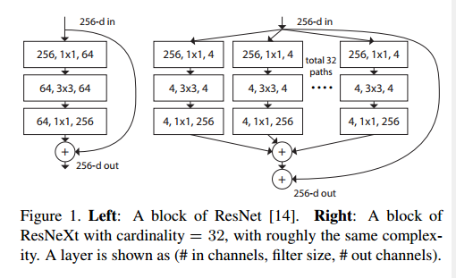
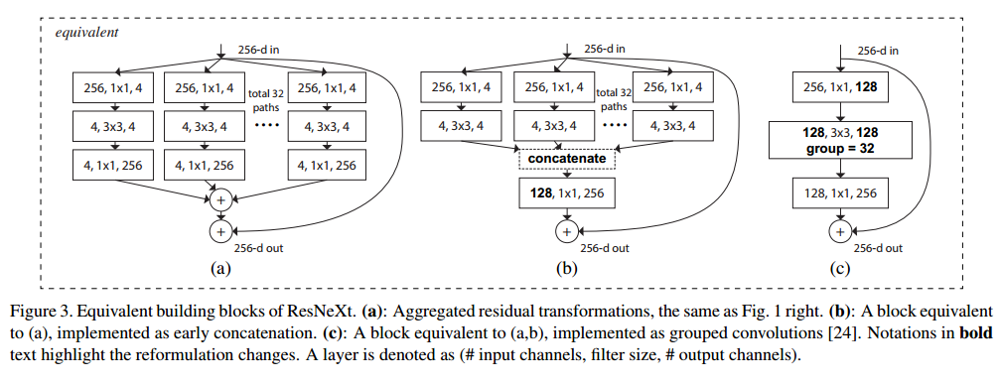
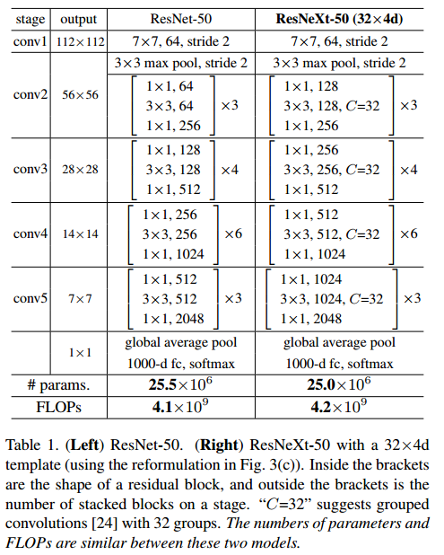

## ResNeXt Aggregated Residual Transformations for Deep Neural Networks

### Motivation

Research on visual recognition is undergoing a transition from "feature engineering" to "network engineering"

VGG/ResNets are stable network structure, and **split-transform-merge**(Inception) decrease the computational complexity. However, the problem is the architecture of Inception is hard to design for new datasets/tasks due to many factors and hyper-paramaters.

In this paper, **we present a simple architecture which adopts VGG/ResNets' strategy of repeating layers, while exploiting the split-transform-merge strategy in an easy, extensible way**

### Model

The module has two other equivalent forms, and the third is reshaped by **grouped convolutions**

Our method indicates that **cardinality** (the size of the set of transformations) is a concrete, measurable dimension that is of central importance, in addition to the dimensions of width and depth. **Increasing cardinality is a more effective way of gaining accuracy than going deeper or wider**

#### Revisiting Simple Neurons

Inner product can be thought of as a form of aggregating transformation
$$
\sum^D_{i=1}w_ix_i
$$
This operation can be recast as a combination of **splitting, transforming, and aggregating**.

* Splitting: the vector $\mathbf x$ is sliced as a low-dimensional embedding, a single-dimension subspace $x_i$
* Transforming: the low-dimensional representation is transformed by $w_i x_i$
* Aggregating: the transformation in all embedding are aggregated by $\sum^D_{i=1}$

#### Aggregated Transformations

#### Model Capacity

### Implementation details

#### 总结

利用grouped convolution变相提高depth of convolution. 比如, 对Basicblock来说, 从64 -> 64 -> 64, 变为64 -> 128 -> 64, 并保证几乎相同的计算性能; 对BottleneckBlock来说, 从128 -> 64 -> 64 -> 256, 变为128 -> 128 -> 128 -> 512. Group的数量叫做, cardinality, 且越高, 性能越好

