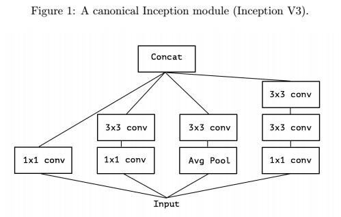
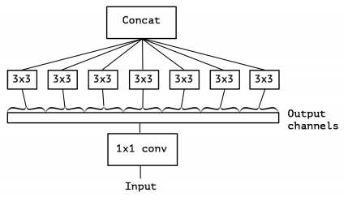
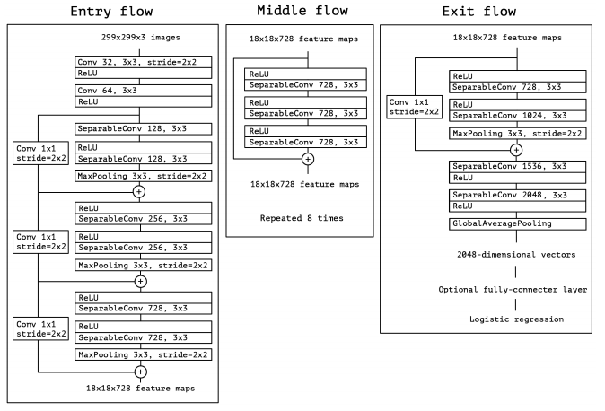

## Xception

### Motivation

A convolutional layer attempts to learn filters in a 3D space, with 2 spatial dimensions and a channel dimensions. Thus a single convolution kernel is tasked with simultaneously mapping cross-channel correlations and spatial correlations (PS: 单卷积就是持续映射通道间相关性和空间相关性). **If cross-channel correlations and spatial correlations are looked at independently, the process would be easier and more efficient**. This is the basic idea behind Inception. 

Typically, Inception module first looks at cross-channel correlations via a set of 1 1 convolutions, mapping the input data into 3 or 4 separate spaces that are smaller than the original input space, and then maps all correlations in these smaller 3D spaces, via regular 3 3 or 5 5 convolutions.

In effect, the fundamental hypothesis behind Inception is that cross-channel correlations and spatial correlations are sufficiently decoupled that it is preferable not to map them jointly.

### Extreme Inception

**What is the hypothesis of Xception and Inception?**

In short, the Xception architecture is a linear stack of separable convolution layers with residual connections.

A stronger hypothesis: the mapping of cross-channels correlations and spatial correlations in the feature maps of convolutional neural networks can be entirely decoupled. That is, we set the number of 3 3 convolutions is as same as the depth of 1 1 convolutions. Or, each feature map maps one 3 3 convolution.

A separable convolution corresponds to the other extreme where there is one segment per channel. Inception modules lie in between, dividing a few hundreds f channels into 3 or 4 segments.

